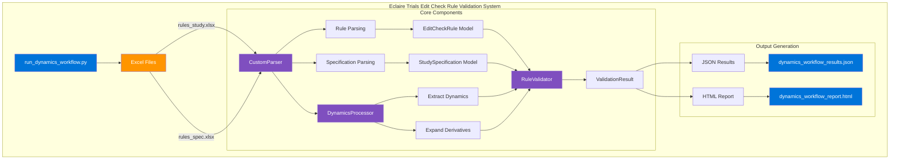

# Eclaire Trials Edit Check Rule Validation System - Dynamics Workflow Architecture

## Overview

The architecture diagram above illustrates the components and data flow when running the `run_dynamics_workflow.py` script. This workflow is designed to process clinical trial edit check rules with dynamics and derivatives support.

## Components

### Input Layer
- **run_dynamics_workflow.py**: Entry point script that orchestrates the workflow
- **Excel Files**: Source data files (rules_study.xlsx and rules_spec.xlsx)

### Core Processing Layer
- **CustomParser**: Parses Excel files and extracts dynamics
- **DynamicsProcessor**: Processes dynamic functions and creates derivatives
- **RuleValidator**: Validates rules against specifications with dynamics support

### Data Models
- **EditCheckRule**: Represents a clinical trial edit check rule
- **StudySpecification**: Represents the study specification with forms and fields
- **ValidationResult**: Contains validation results for each rule

### Output Layer
- **JSON Results**: Structured validation results in JSON format
- **HTML Report**: Branded report with Eclaire Trials colors showing validation results

## Data Flow

1. The workflow begins by reading the Excel files from the data/excel directory
2. The CustomParser extracts rules and specifications from the Excel files
3. The DynamicsProcessor identifies dynamic functions in rule conditions
4. The DynamicsProcessor expands the specification with a Derivatives form
5. The RuleValidator validates the rules against the specification
6. Results are exported as JSON and a branded HTML report

## Technology Stack

- **Python**: Core programming language
- **Pandas**: Used for Excel file processing
- **FastAPI**: Available for API integration (not used in this workflow)
- **Docker**: Available for containerization (not used in this workflow)

## Branding

The system adheres to Eclaire Trials brand colors:
- Primary: Blue (#0074D9)
- Secondary: Orange (#FF9500)
- Accent: Purple (#7F4FBF)
